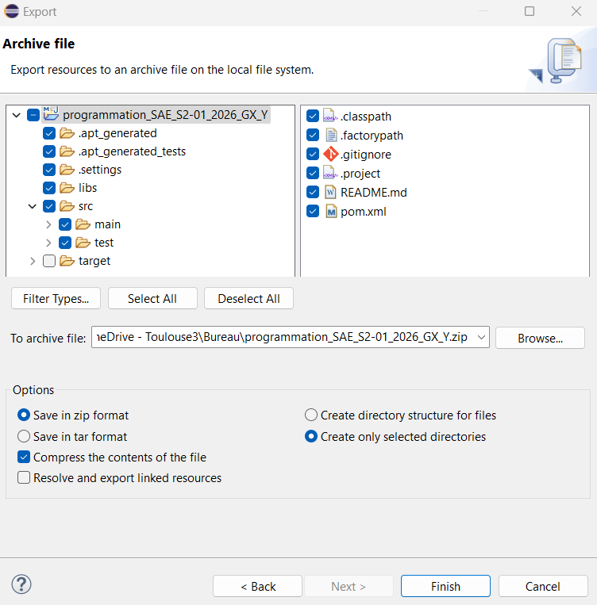

# Application de vente · Fromagerie 🧀

Application Java Swing qui simule une boutique de fromages : catalogue, panier, saisie des informations client et génération de facture. Projet réalisé dans le cadre d'une SAÉ du BUT Informatique (IUT Paul Sabatier, Toulouse).



## Fonctionnalités

- Catalogue de fromages (vache, chèvre, brebis) avec filtres par type de lait et par format (demi / entier)
- Gestion du stock : message d'avertissement si la quantité demandée dépasse le stock, mention « Rupture » à zéro
- Panier d'achat : modification des quantités, vidage du panier, calcul des frais de port
- Formulaire de saisie des informations client, avec validation
- Facture récapitulative, avec option d'impression

## Technologies

- Java
- Swing (interface graphique multi-fenêtres avec des `JDialog` imbriquées pour chaque étape du parcours client)
- JSON (données des produits)
- Maven

## Lancer le projet

Prérequis : un JDK installé, et Eclipse (ou un autre IDE compatible Maven).

1. Cloner le dépôt :
   ```
   git clone https://github.com/mehdiqament/sae-vente-fromages.git
   ```
2. Dans Eclipse : **File → Import → Maven → Existing Maven Projects**, puis choisir le dossier cloné.
3. Installer la bibliothèque fournie dans `libs/` (une seule fois sur la machine) : clic droit sur le projet → **Run As → Maven build…**, puis dans **Goals** :
   ```
   install:install-file -Dfile=libs/annotation-lib-0.0.1-SNAPSHOT.jar -DpomFile=libs/annotation-lib-0.0.1-SNAPSHOT.pom -DgroupId=fr.iut-tlse3.fr -DartifactId=annotation-lib -Dversion=0.0.1-SNAPSHOT -Dpackaging=jar
   ```
4. Clic droit sur le projet → **Maven → Update Project**.
5. Lancer l'application depuis Eclipse (**Run As → Java Application**) sur la classe qui contient la méthode `main`.

## Démonstration

Une vidéo de démonstration est disponible sur la [page du projet](https://mehdiqament.dev/projets/fromagerie.html) de mon portfolio.

## Auteur

Mehdi Bouin · [mehdiqament.dev](https://mehdiqament.dev)
